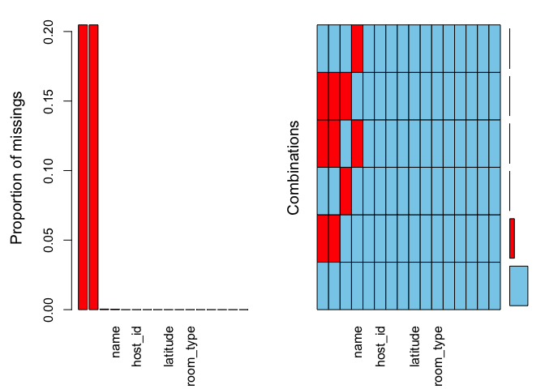
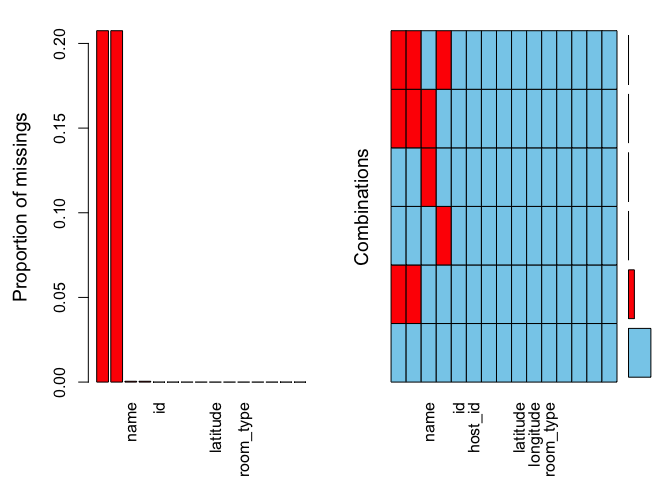
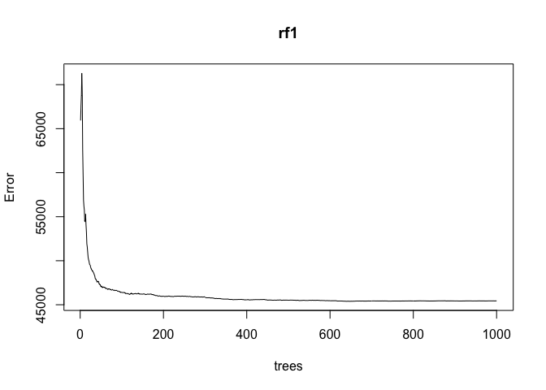
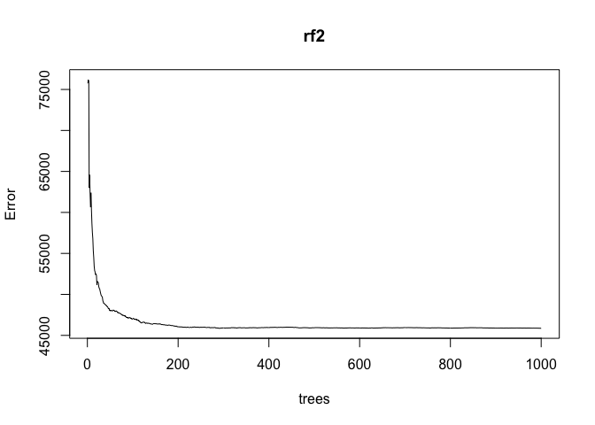
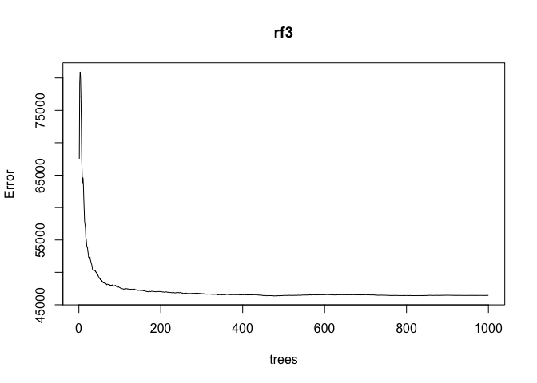

Airbnb Price Prediction
================

## Data

This is from a Kaggle competition (and was a school project). The data
is a training and test set of Airbnb listings with attributes such as
location, neighborhood, minimum nights, availability, and reviews. This
particular piece of the project fits a Random Forest model.

``` r
library(tidyverse)
library(mice)
library(VIM)
library(lubridate)
library(caret)
library(randomForest)

train <- read_csv("train.csv")
test <- read_csv("test.csv")
```

Any missing values?

``` r
aggr(train, labels = names(train), sortVars = TRUE)
```

<!-- -->

    ## 
    ##  Variables sorted by number of missings: 
    ##                        Variable        Count
    ##                     last_review 0.2047566178
    ##               reviews_per_month 0.2047566178
    ##                       host_name 0.0004090458
    ##                            name 0.0002629580
    ##                              id 0.0000000000
    ##                         host_id 0.0000000000
    ##             neighbourhood_group 0.0000000000
    ##                   neighbourhood 0.0000000000
    ##                        latitude 0.0000000000
    ##                       longitude 0.0000000000
    ##                       room_type 0.0000000000
    ##                           price 0.0000000000
    ##                  minimum_nights 0.0000000000
    ##               number_of_reviews 0.0000000000
    ##  calculated_host_listings_count 0.0000000000
    ##                availability_365 0.0000000000

most of the missing training data is the date of last review and the
number of reviews per month.

``` r
aggr(test, labels = names(test), sortVars = TRUE)
```

<!-- -->

    ## 
    ##  Variables sorted by number of missings: 
    ##                        Variable        Count
    ##                     last_review 0.2075124412
    ##               reviews_per_month 0.2075124412
    ##                            name 0.0004771968
    ##                       host_name 0.0004771968
    ##                              id 0.0000000000
    ##                         host_id 0.0000000000
    ##             neighbourhood_group 0.0000000000
    ##                   neighbourhood 0.0000000000
    ##                        latitude 0.0000000000
    ##                       longitude 0.0000000000
    ##                       room_type 0.0000000000
    ##                  minimum_nights 0.0000000000
    ##               number_of_reviews 0.0000000000
    ##  calculated_host_listings_count 0.0000000000
    ##                availability_365 0.0000000000

Same story for the test set.

The data set needs some cleaning such as creating factors for columns
and I also want to split the review date into 3 individual features for
day, month, and year. (my days before being good at tidyverse)

``` r
train$last_review_year <- year(train$last_review)
train$last_review_month <- month(train$last_review)
train$last_review_day <- mday(train$last_review)
train$last_review_dayofyear <- yday(train$last_review)
train$last_review_dayofweek <- wday(train$last_review)
train$neighbourhood_group <- as.factor(train$neighbourhood_group)
train$neighbourhood <- as.factor(train$neighbourhood)
train$room_type <- as.factor(train$room_type)

test$last_review_year <- year(test$last_review)
test$last_review_month <- month(test$last_review)
test$last_review_day <- mday(test$last_review)
test$last_review_dayofyear <- yday(test$last_review)
test$last_review_dayofweek <- wday(test$last_review)
test$neighbourhood_group <- as.factor(test$neighbourhood_group)
test$neighbourhood <- as.factor(test$neighbourhood)
test$room_type <- as.factor(test$room_type)
```

## Imputing missing data

This project will leave out most of the text columns as their are too
many factor levels to run the model. But in the future it would be cool
to see how words used would affect price.

``` r
train <- train %>% 
  select(-last_review, -host_name, -name, -neighbourhood)

test <- test %>% 
  select(-last_review, -host_name, -name, -neighbourhood)

set.seed(123)
mids <- mice(train, m = 1, method = "rf")
```

    ## 
    ##  iter imp variable
    ##   1   1  reviews_per_month  last_review_year  last_review_month  last_review_day  last_review_dayofyear  last_review_dayofweek
    ##   2   1  reviews_per_month  last_review_year  last_review_month  last_review_day  last_review_dayofyear  last_review_dayofweek
    ##   3   1  reviews_per_month  last_review_year  last_review_month  last_review_day  last_review_dayofyear  last_review_dayofweek
    ##   4   1  reviews_per_month  last_review_year  last_review_month  last_review_day  last_review_dayofyear  last_review_dayofweek
    ##   5   1  reviews_per_month  last_review_year  last_review_month  last_review_day  last_review_dayofyear  last_review_dayofweek

``` r
comp <- complete(mids, 1)

set.seed(11111)
midstest <- mice(test, m = 1, method = "rf")
```

    ## 
    ##  iter imp variable
    ##   1   1  reviews_per_month  last_review_year  last_review_month  last_review_day  last_review_dayofyear  last_review_dayofweek
    ##   2   1  reviews_per_month  last_review_year  last_review_month  last_review_day  last_review_dayofyear  last_review_dayofweek
    ##   3   1  reviews_per_month  last_review_year  last_review_month  last_review_day  last_review_dayofyear  last_review_dayofweek
    ##   4   1  reviews_per_month  last_review_year  last_review_month  last_review_day  last_review_dayofyear  last_review_dayofweek
    ##   5   1  reviews_per_month  last_review_year  last_review_month  last_review_day  last_review_dayofyear  last_review_dayofweek

``` r
imptest <- complete(midstest, 1)
```

So now there is a full test and train data set. Have to love the MICE
package.

## Random Forest Models

First we will split the training set into a train/test split for model
cross validation.

``` r
set.seed(1124)
trainindex <- createDataPartition(comp$price, p = 0.70, list = FALSE)
comptrain <- comp[trainindex,]
comptest <- comp[-trainindex,]
```

Then I fit 3 RF models with varying mtry (3 here). These can take a
while…

``` r
set.seed(333)
rf1 <- randomForest(price ~ ., data = comptrain, mtry = 3, ntree = 1000,
                    importance = TRUE)
plot(rf1)
```

<!-- -->

``` r
which.min(rf1$mse)
```

    ## [1] 640

mtry of 6

``` r
set.seed(444)
rf2 <- randomForest(price ~ ., data = comptrain, mtry = 6, ntree = 1000,
                    importance = TRUE)
plot(rf2)
```

<!-- -->

``` r
which.min(rf2$mse)
```

    ## [1] 1000

mtry of 9

``` r
set.seed(555)
rf3 <- randomForest(price ~ ., data = comptrain, mtry = 9, ntree = 1000,
                    importance = TRUE)
plot(rf3)
```

<!-- -->

``` r
which.min(rf3$mse)
```

    ## [1] 476

Ideally would search across a grid for the best fit, but I ran into time
and laptop constraints. Now that I am familiar with tidy models that
would be cool to try!

## Model comparison

Lets compare the models and see which performed best. The criteria for
this project was RMSLE. Can generate predictions first, then compare the
RMSLE for each model.

``` r
pricehat1 <- predict(rf1, newdata = comptest)
pricehat2 <- predict(rf2, newdata = comptest)
pricehat3 <- predict(rf3, newdata = comptest)

RMSLE <- function(preds, actual) {
  logs <- (log(preds + 1) - log(actual + 1))^2
  roots <- sqrt(mean(logs))
  return(roots)
}

RMSLE(pricehat1, comptest$price)
```

    ## [1] 0.4865015

``` r
RMSLE(pricehat2, comptest$price)
```

    ## [1] 0.4857564

``` r
RMSLE(pricehat3, comptest$price)
```

    ## [1] 0.4873965

These are all pretty close, but the second model has the lowest RMSLE.
This was the mtry = 6.

Now can fit the middle model on the test data and submit!

``` r
testhat <- predict(rf2, newdata = imptest)  
rfsubmit <- data.frame(imptest$id, testhat)
names(rfsubmit)[1] <- "id"
names(rfsubmit)[2] <- "price"
#write_csv(rfsubmit, "abbrfsubmit.csv")
```

My final score for the Random Forest model was 0.48961

## In the Future

There is a lot of opportunity to refine this analysis, especially being
able to utilize the text from listings. I did not have the knowledge to
implement such a task at the time, but my skills have grown and this
would be interesting to revisit soon!
